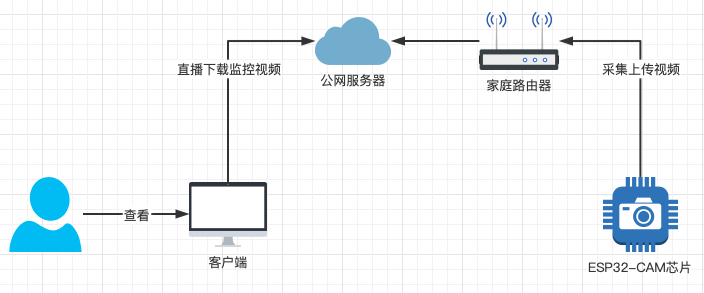
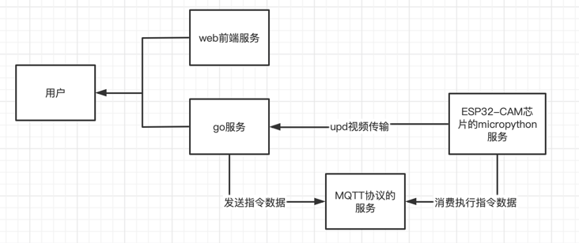

# 物联网视频监控服务

### 功能点

* 视频帧上传服务器
* 通过opencv判断被监控场景是否有变化,无变化则休眠一段时间再进行监控
* 视频根据文件大小覆盖存储
* 服务器发送命令给 机器执行,从而实现 机器休眠监控功能
* 机器温度过高自动 休眠一段时间后再尝试监控

### gin web服务功能点

* 实时监控数据upd传输给客户端
* 历史视频文件分页列表查询,并返回视频封面
* 提供视频下载服务

### 客户端功能点

* 点击开启或关闭实时视频监控功能
* 显示 历史视频文件分页列表
* 下载视频

### 技术点

* 软件:micropython+python+go+MQTT协议

### 服务间网络拓扑图



### 系统架构图



### 相关链接:

* [基于ESP8266的MicroPython连接MQTT服务器](https://blog.csdn.net/zhuwade/article/details/121792955)
* [micropython-lib](https://github.com/micropython/micropython-lib/tree/master/micropython)
* [GoCV MORE EXAMPLES](https://gocv.io/writing-code/more-examples/)

### bug记录

* upd发送数据失败,报错 ```Message too long```,错误原因:系统限制UDP发送数据字节数大小 解决方法:修改系统配置  ```ysctl -w net.inet.udp.maxdgram=65507```
* [相关链接](https://www.cnblogs.com/yajunLi/p/6595509.html)

