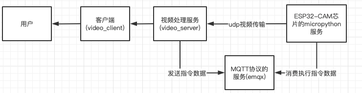

# 物联网视频监控服务

### 功能点

* 通过UDP协议上传视频到服务器功能;
* 通过UDP协议实现实时监控功能;
* 通过opencv判断被监控场景是否有变化,动态调整 摄像头上传频率(FPS)功能;
* 视频实时存储到磁盘(只存储 监测到变化的视频帧,且标记时间及不同点)功能;
* 视频文件7天自动覆盖功能;
* 历史视频下载到指定文件夹功能;

### gin web服务(video_server项目)功能点

* 接收视频上传功能;
* 利用opencv动态检测 视频帧是否变化,提供并存储功能,
* 实时视频帧通过udp协议转发给客户端功能;
* 视频下载功能;

### 客户端(video_client项目)功能点

* 开启或关闭实时视频监控功能
* 根据输入的开始结束时间下载视频文件到指定文件夹

### 技术点
* 语言:go+python+micropython
* 软件或框架:gin(go语言的web框架)+fyne(go语言的GUI框架)+emqx(MQTT协议的实现)+gocv(opencv的go语言实现)
* 应用层协议:MQTT,HTTP
* 传输层协议:UDP,TCP
* 硬件:ESP32-CAM开发套件

### 服务间数据流向图



### 相关链接:

* [基于ESP8266的MicroPython连接MQTT服务器](https://blog.csdn.net/zhuwade/article/details/121792955)
* [micropython-lib](https://github.com/micropython/micropython-lib/tree/master/micropython)
* [GoCV MORE EXAMPLES](https://gocv.io/writing-code/more-examples/)

### bug记录

* udp发送数据失败,报错 ```Message too long```,错误原因:系统限制UDP发送数据字节数大小 解决方法:修改系统配置  ```ysctl -w net.inet.udp.maxdgram=65507```
* [相关链接](https://www.cnblogs.com/yajunLi/p/6595509.html)
